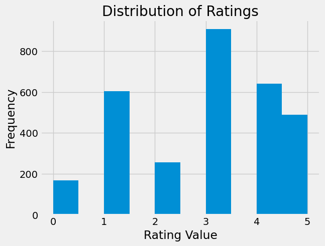
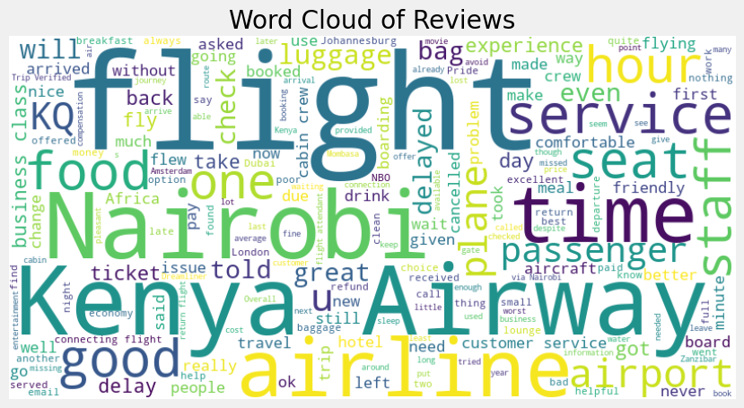
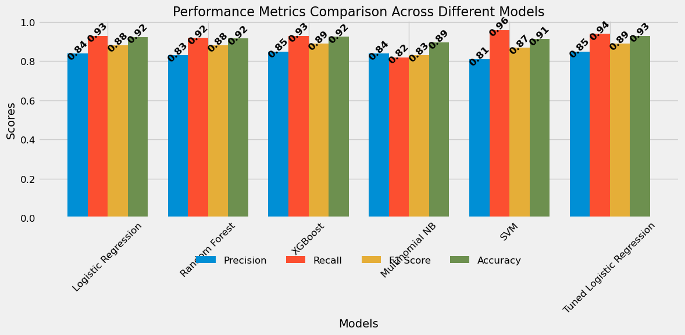

# AIRLINE-SENTIMENT-ANALYSIS

# Authors
* Jeremy Waiguru
* Paul Ngatia
* Winfred Bundi
* Mercy Kiragu

# TABLE OF CONTENTS
1. [BUSINESS UNDERSTANDING](#BUSINESS-UNDERSTANDING)
2. [PROBLEM STATEMENT](#PROBLEM-STATEMENT)
3. [DATA UNDERSTANDING](#DATA-UNDERSTANDING)
4. [VISUALIZATIONS](#VISUALIZATIONS)
5. [MODELLING PROCESS,(DEPLOYMENT)](#MODELLING-AND-DEPLOYMENT)
6. [EVALUATION](#EVALUATION)
7. [CONCLUSIONS](#CONCLUSIONS)
8. [RECOMMENDATIONS](#RECOMMENDATIONS)

# BUSINESS UNDERSTANDING.

In the competitive aviation industry, customer satisfaction plays a vital role in shaping the reputation and success of an airline. Kenya Airways, like many airlines, receives numerous reviews from passengers, which contain valuable feedback about their experiences. Understanding the sentiments behind these reviews is essential for identifying strengths and weaknesses in service delivery. This project will leverage sentiment analysis to process and analyze customer feedback, enabling Kenya Airways to make informed decisions that enhance passenger satisfaction and loyalty.

# PROBLEM STATEMENT.

Kenya Airways is challenged by the vast amount of unstructured customer feedback available through online reviews. Without an efficient method to analyze this feedback, the airline may overlook critical insights that could lead to service improvements. This project aims to address this challenge by systematically analyzing the sentiment of customer reviews, providing Kenya Airways with a clear understanding of customer perceptions and identifying key areas that require attention.

# DATA UNDESRTANDING

We did Web Scraping from the 3 websites below and merged our datasets

1. <https://uk.trustpilot.com/review/www.kenya-airways.com> 

2. <https://www.airlinequality.com/airline-reviews/kenya-airways/>

3. <https://www.airlineratings.com/airlines/kenya-airways>

# VISUALIZATIONS 

The distribution of ratings for Kenya Airways indicates a wide range of customer experiences. The majority of customers rate their experience as average (Rating 3), but there is a significant number of dissatisfied customers (Rating 1). On the positive side, there are also many customers who rated their experience as good (Rating 4) or excellent (Rating 5), though these are fewer compared to the average and poor ratings.

This distribution suggests that while there is satisfaction among a portion of the customer base, there is a need to address the concerns of those who had poor experiences to improve overall customer satisfaction and reduce the number of average and dissatisfied customers.

Word cloud to visually represent the most common words found in both positive and negative reviews, providing insights into key themes and sentiments expressed by users. 

# MODELLING AND DEPLOYMENT

In the context of engagement prediction, the approach involves several key steps: data splitting for training, testing, followed by the training and evaluation of various models.

To build our Classifier and predictive system we explored the various models listed below;

 1. Logistic Regression with TF-IDF
 2. Naive Bayes
 3. SVM
 4. Random Forest
 5. XG-Boost

 These models are assessed using metrics like Accuracy, RMSE, and ROC Curve with an emphasis on achieving high accuracy in sentiment analysis. Hyperparameter tuning and ensemble modeling are used to enhance model performance, and the best-performing models are selected.

 Additionally, natural language understanding (NLU) was implemented to extract context from user reviews for personalized responses. Testing and training ensure appropriate responses to various sentiments, and best model is integrated with the user interface and deployed at scale, using Streamlit and Pickle for model deployment. The project's scalability allows Kenya Airways to customize sentiment analysis and engagement prediction for their specific needs, fostering industry-wide improvements in customer engagement and satisfaction. 

 # EVALUATION

 

 Based on the performance metrics, Tuned Logistic Regression is the best model for this particular dataset and task, offering a good balance between Precision, Recall, F1 Score, and Accuracy.

 # CONCLUSIONS

 1. North Africa : These regions have the lowest average ratings. Kenya Airways should investigate and address the specific issues affecting these areas, focusing on service quality, punctuality, and customer experience.

2. Southeast Asia: With the highest average rating, Kenya Airways should maintain and further enhance services in this region. It can serve as a benchmark for other routes.

3. Class Ratings: The average rating is highest for Business Class, followed by Economy Class, with "Unknown" receiving the lowest average rating. Customer Satisfaction: This suggests that customers in Business Class tend to be more satisfied compared to those in Economy or with unspecified classes.

4. There substantial dissatisfaction expressed by customers regarding flight delays and cancellations underscores a critical issue that demands immediate and strategic intervention.

# RECOMMENDATIONS

1. To the marketing department,Use positive feedback from high-performing regions like Southeast Asia and Domestic routes in marketing campaigns to highlight Kenya Airways’ commitment to quality service.

2. Improving the experience for Economy and "Unknown" classes could potentially enhance overall customer satisfaction.

3. It is essential to focus on improving the reliability of flight schedules and the efficiency of response mechanisms. Implementing robust measures to reduce delays and cancellations, such as optimizing scheduling, enhancing operational processes, and investing in real-time management systems, will be crucial.

4. Compensation Policies: Review and enhance compensation policies for inconvenienced passengers to rebuild trust and demonstrate commitment to customer satisfaction.

#  MODEL DEPLOYMENT

Here is the url to our deployment app ,

https://jer1yanalst-capstone-project-sentiment-ana-streamlit-app-exz4hd.streamlit.app/

